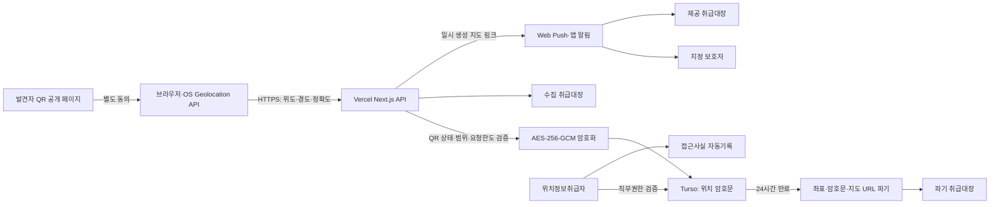

# REAL_QR_FIND 위치정보 보호조치 구현·증빙 안내서

- 작성일: 2026-08-09
- 서비스: 제자리 QR 안심 서비스
- 운영 URL: `https://zezari.family`
- 목적: 위치기반서비스 사업계획서 검토 요청사항에 대한 구현 결과와 제출 증빙 구분

> 이 문서는 구현 사실을 정리한 기술 산출물이다. 신고 적합성, 원본 위치정보의 보유시간, 국외이전·위탁 고지와 담당자 지정은 제출 전에 위치정보 전문 법률 검토를 거쳐 확정한다.

## 1. 검토 요청사항 반영표

| 요청 항목 | 반영 내용 | 상태 | 증빙 |
| --- | --- | --- | --- |
| 2.1 서비스 시나리오 | QR 접근, 별도 동의, 단말 위치권한, 암호화 저장, 보호자 제공, 24시간 자동 파기 순서 정리 | 구현·문서화 | 공개 위치공유 화면, 취급대장 |
| 2.2 데이터 흐름도 | 브라우저/OS → Next.js API → Turso 암호문 → Web Push → 보호자 → 자동 파기 흐름 정리 | 구현·문서화 | 본 문서 3장 |
| ID/PW 인증 | NextAuth 개별 계정, PBKDF2-SHA-256 비밀번호 해시 | 구현 | 로그인 화면, 소스 |
| 3회 불일치 제한 | 동일 로그인 식별자 3회 실패 시 15분 잠금, 성공 시 초기화 | 구현·시험 완료 | 보안관리 화면, `auth_login_attempts` |
| 비밀번호 규칙 | 8~16자, 영문·숫자·특수문자 조합을 가입·변경 시 검증 | 구현 | 가입/보호자정보 저장 로직 |
| 단계별 접근권한 | 시스템 자동수집, 관리책임자, 취급자 역할과 이용·제공·파기·내보내기 권한 분리 | 구현 | 위치정보 보안관리 권한표 |
| 취급대장 | 수집·제공·파기를 좌표 없이 자동 기록, 대상·경로·서비스·수신자·목적·시각 포함 | 구현 | `location_use_ledger`, 관리자 그리드 |
| 열람·고지 대응 기록 | 취급대장 구조에 요청자·취급자·목적·시각 필드 준비 | 부분 구현 | 실제 민원 처리 입력 UI는 후속 운영 기능 |
| 저장 암호화 | 위도·경도·정확도·위치설명 AES-256-GCM 암호화, 키는 Vercel Secret 분리 | 구현 | 보안관리 화면, DB 암호문 |
| 구간 암호화 | HTTPS/TLS, HSTS, 보안 헤더 | 구현 | 인증서·응답 헤더 캡처 필요 |
| 방화벽/접근통제 | 서버 세션·직무권한 검증, 공개 위치공유 시간당 10회 제한 | 구현 | 소스·테스트 결과, Vercel Firewall 화면 별첨 필요 |
| 접근사실 기록 | 인증, 목록/상세 열람, 내보내기, 권한변경 기록 | 구현 | `location_access_logs`, 관리자 그리드 |
| 위변조 방지 | 직전 기록 해시와 현재 HMAC-SHA-256 해시를 연속 저장 | 구현 | 접근기록·취급대장 무결성 열 |
| 원본 파기 | 수집 후 24시간 경과 시 좌표 암호문·지도 URL·위치설명 자동 삭제, 파기대장 기록 | 구현 | 파기 완료 현황·취급대장 |
| 보안프로그램 | 서버리스 플랫폼 보안과 의존성 점검은 문서화 | 운영 증빙 필요 | 관리자 PC 백신·OS 업데이트 화면 별첨 |

## 2. 서비스 시나리오

1. 발견자가 관리대상의 QR 또는 공개 링크로 접속한다.
2. 서버가 QR 활성화, 관리대상 매칭과 서비스 이용 가능 상태를 검증한다.
3. 발견자가 위치공유 버튼 영역에서 수집항목, 목적, 제공받는 자와 24시간 보유기간을 확인하고 별도 동의한다.
4. 브라우저와 단말 운영체제가 위치 권한을 요청한다.
5. 동의와 권한이 모두 확인된 경우에만 위도·경도·정확도를 HTTPS로 서버에 전송한다.
6. 서버는 좌표 범위와 반복 요청 한도를 확인한 후 AES-256-GCM 암호문만 DB에 저장한다.
7. 위치정보 수집 사실을 취급대장에 기록하고, 좌표로 카카오맵 링크를 일시 생성하여 지정 보호자에게 푸시로 제공한다.
8. 제공 결과를 취급대장에 자동 기록한다.
9. 권한 있는 위치정보취급자는 관리자 화면에서 필요한 시간 동안만 위치를 열람한다. 열람·내보내기 이력은 접근기록에 남는다.
10. 수집 후 24시간이 지나면 원본 좌표 암호문과 지도 URL을 복구 불가능하게 삭제하고 파기 사실만 보존한다.

## 3. 위치정보 데이터 흐름도

## 4. 단계별 접근권한

모든 직무에 `O`를 부여하지 않는다. 자동수집은 사람 계정에서 분리하고, 파기·내보내기·권한관리는 관리책임자에게만 부여한다.

| 구분 | 수집 | 이용/열람 | 보호자 제공 | 파기 | 내보내기 | 권한관리 |
| --- | --- | --- | --- | --- | --- | --- |
| 시스템 자동처리 | O | O | O | O | - | - |
| 위치정보관리책임자 | - | O | O | O | O | O |
| 위치정보취급자 | - | O | O | - | - | - |
| 일반 관리자 | - | - | - | - | - | - |

권한 부여·변경·말소 시 대상자, 수행자, 사유, 변경 전·후 권한, 시각과 연속 무결성 해시를 `location_permission_history`에 기록하고 5년 이상 보존한다.

## 5. 취급대장 자동기록 항목

| 양식 항목 | 시스템 기록값 |
| --- | --- |
| 대상 | 직접 개인정보 대신 동의·요청 세션의 HMAC 식별값 |
| 취득경로 | QR 공개 페이지 / 단말기 브라우저 Geolocation API |
| 제공 서비스 | 제자리 QR 안심 서비스 |
| 제공받는 자 | 관리대상이 등록된 지정 보호자 또는 제3자 제공 없음 |
| 이용·제공·파기 일시 | 초 단위 서버 시각 |
| 취급자 | 자동처리는 `system`, 관리자 처리는 내부 관리자 식별값 |
| 요청자 | 공개 요청·관리자 계정의 비식별 참조값 |
| 목적 | 안전한 인계, 운영 확인, 보호조치 점검 등 실제 목적 |
| 결과 | `success`, `stored_only`, `failed`, `blocked` |
| 무결성 | 이전 기록 해시 + 현재 기록 HMAC-SHA-256 |

## 6. 주요설비와 설치장소

| 장비항목 | 활용기능 | 설치장소/확인자료 |
| --- | --- | --- |
| Vercel CDN·웹 호스팅 | HTTPS, PWA, 정적자원 제공 | Vercel 클라우드, 프로젝트·도메인·Invoice 캡처 |
| Vercel Functions | 인증, 위치공유 API, 암호화·파기 로직 | Vercel 서버리스 리전, 프로젝트 설정 캡처 |
| Turso/libSQL | 회원·QR·위치 암호문·취급대장·접근로그 저장 | Turso 클라우드 리전, DB·청구/계정 화면 |
| GitHub | 소스·변경·배포이력 | GitHub 클라우드, 저장소 권한 화면 |
| 관리자 업무용 PC | 위치정보 운영·민원·보안 점검 | 사업장, PC 사진·백신·OS 업데이트 캡처 |
| 사업장 네트워크 | 관리자 접속 | 사업장, 공유기 보안설정·펌웨어 화면 |

클라우드 물리 주소는 제공사업자의 실제 리전 확인자료 범위까지만 기재한다. 별도 IDC 계약서가 없으면 Vercel/Turso 계정정보, 서비스 제공자명, 프로젝트·DB 기능과 Invoice를 첨부한다.

## 7. 증빙 파일

- `evidence/01-location-security-dashboard.png`: 암호화·자동파기·권한표·취급대장·접근기록 통합 화면
- `evidence/02-admin-social-login.png`: 관리자 소셜 식별·인증 화면
- `evidence/03-location-consent.png`: 공개 위치공유 화면의 별도 동의 구성

다음 자료는 운영자가 외부 콘솔 또는 관리자 PC에서 추가 캡처해야 한다.

1. `zezari.family` TLS 인증서 상세와 만료일. 제출일 기준 유효기간 1개월 이상인지 확인한다.
2. Vercel 프로젝트 계정·도메인·Firewall/WAF 또는 플랫폼 보안 화면과 Invoice.
3. Turso 계정·DB 리전·백업·저장 암호화 공식 확인자료와 Invoice.
4. Vercel 환경변수 목록. 키 이름만 보이고 값은 반드시 마스킹한다.
5. 관리자 PC 백신 실시간 감시, 최근 업데이트일, OS 자동업데이트와 화면잠금 설정.
6. GitHub·Vercel·Turso 관리자 계정의 MFA 활성 화면.
7. 위치정보관리책임자와 취급자 지정서, 보안서약서, 연 1회 교육·자체검사 기록.

## 8. 관련 기준

- [위치정보의 보호 및 이용 등에 관한 법률 제16조](https://law.go.kr/lsLinkCommonInfo.do?chrClsCd=010202&lsJoLnkSeq=1023742095)
- [위치정보의 보호 및 이용 등에 관한 법률 제23조](https://law.go.kr/lsLinkCommonInfo.do?chrClsCd=010202&lsJoLnkSeq=1030160469)
- [위치정보의 관리적·기술적 보호조치 기준](https://www.law.go.kr/LSW/admRulInfoP.do?admRulSeq=2100000279386&chrClsCd=010201)

