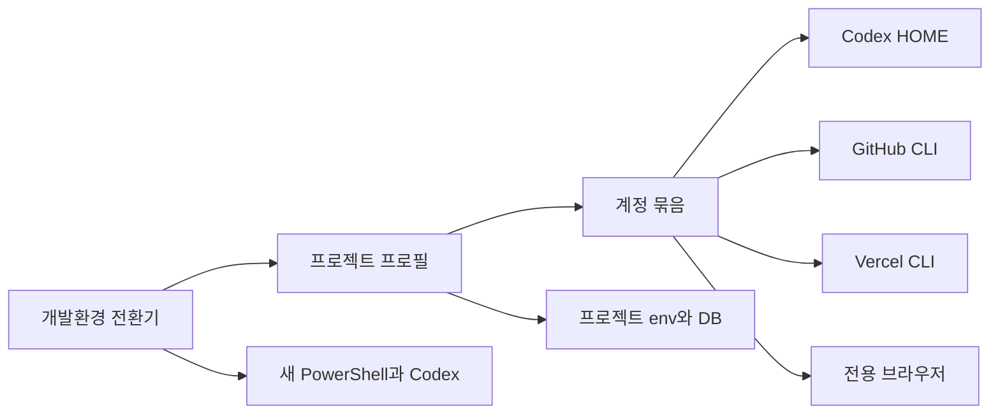

# 개발환경 전환기 구현 및 사용 설명서

## 1. 구현 결과

Windows에서 프로젝트별 GitHub, Vercel, DB, Codex 개발환경을 분리 실행하는 `개발환경 전환기`를 구현했다.

- 소스: `tools/dev-profile-switcher/`
- 설치 위치: `%LOCALAPPDATA%\DevProfileSwitcher\app`
- 실행파일: `DevProfileSwitcher.exe`
- 명령 실행기: `%LOCALAPPDATA%\Microsoft\WindowsApps\dev.cmd`
- 바탕화면 바로가기: `개발환경 전환기`
- 사용자 프로필 저장소: `%LOCALAPPDATA%\DevProfileSwitcher`

## 2. 가장 쉬운 사용법

GUI는 바탕화면의 `개발환경 전환기`를 실행하거나 터미널에서 다음 명령으로 연다.

```powershell
dev
```

등록된 프로젝트를 Codex CLI로 바로 열려면 다음 명령만 사용한다.

```powershell
dev zezari
dev stock
```

명령을 실행하면 새 PowerShell 창에 선택한 프로젝트의 환경만 적용하고 해당 폴더에서 Codex CLI를 시작한다. 이미 실행 중인 다른 프로젝트 창은 변경하지 않는다.

## 3. 구현된 기능

### 기존 프로젝트 가져오기

1. GUI에서 `기존 프로젝트 가져오기`를 선택한다.
2. 프로젝트 폴더를 고른다.
3. 현재 PC 계정을 그대로 사용하거나 기존 계정 묶음을 선택한다.
4. 필요한 경우 새 계정 묶음을 만든다.

프로그램은 다음 항목을 값 노출 없이 자동 분석한다.

- Git 저장소와 GitHub 원격 주소
- 저장소별 Git 작성자
- Vercel 로컬 프로젝트 연결
- `.env*` 파일 이름과 환경변수 이름
- Turso, Supabase, PostgreSQL, Firebase, MongoDB 연결 종류

### 새 프로젝트 만들기

1. GUI에서 `새 프로젝트 만들기`를 선택한다.
2. 이름과 상위 폴더를 선택한다.
3. 기존 개발 계정 묶음을 선택하거나 새 계정 묶음을 만든다.
4. 빈 프로젝트 폴더와 전환 프로필을 생성한다.

새 GitHub, Vercel, Codex, Google, Turso 계정은 공급자 약관, MFA와 보안인증 때문에 사용자가 최초 한 번 가입 또는 로그인해야 한다. `계정 브라우저`는 계정 묶음 전용 브라우저 저장공간으로 공급자 페이지를 연다.

### 계정 분리

- Codex: 계정별 `CODEX_HOME`
- GitHub CLI: 계정별 `GH_CONFIG_DIR`
- Git Push: 분리 프로필에서는 해당 `GH_CONFIG_DIR`의 `gh auth git-credential`만 사용
- Vercel: 계정별 `--global-config`
- 브라우저: 계정별 Edge/Chrome user-data 디렉터리
- DB/API: 선택 프로젝트의 `.env.local` 사용, 상위 터미널의 동일 환경변수 제거
- Git 작성자: 계정 묶음의 이름과 이메일을 저장소 로컬 설정으로 적용

## 4. 현재 등록 상태

| 프로젝트 | 경로 | 계정 묶음 | 현재 상태 |
|---|---|---|---|
| ZEZARI | `C:\REAL_QR_FIND` | `current` | 기존 Codex, Vercel, Turso와 Git 작성자 사용 |
| STOCK | `C:\soonsuboy_dev_project\stock` | `stock-personal` | Git 작성자와 Turso 감지, 분리 로그인 준비 |

STOCK에는 기존 커밋 기록을 기준으로 `soonsuboy <soonsuboy10@gmail.com>`을 저장소 로컬 Git 작성자로 설정했다. STOCK의 GitHub CLI, Vercel, Codex는 분리 저장소가 새로 만들어졌으므로 다음 명령 또는 GUI의 `선택 계정 연결`로 최초 한 번 로그인한다.

```powershell
dev login stock-personal all
```

## 5. 명령어

```powershell
dev                         # GUI
dev list                    # 프로젝트 목록
dev accounts                # 계정 묶음 목록
dev status stock            # 연결 상태 확인
dev stock                   # STOCK Codex 실행
dev terminal stock          # STOCK 터미널만 실행
dev login stock-personal all
dev browser stock-personal  # 전용 계정 브라우저
```

기존 프로젝트를 명령으로 등록하는 예:

```powershell
dev import stock C:\soonsuboy_dev_project\stock -Account stock-personal
```

## 6. 보안

- 비밀번호, API 키, 토큰, MFA와 쿠키를 프로젝트 프로필 JSON에 저장하지 않는다.
- `.env.local`의 값은 읽어 프로필에 복사하지 않고 변수 이름만 기록한다.
- 전환 환경은 새 자식 프로세스에만 적용한다.
- 분리 GitHub 프로필은 기존 Windows Git 자격증명으로 fallback하지 않는다.
- Vercel 토큰은 Vercel CLI가 Windows 자격 증명 저장소에 보관한다.
- 활동 로그에는 프로젝트 ID, 계정 ID, 결과와 시간만 기록한다.

## 7. 구조



## 8. 검증

- 임시 Git 저장소와 Turso 환경파일을 사용한 자동 회귀 테스트 통과
- 기존 프로젝트 분석, 새 프로젝트 생성, 계정 전환 통과
- 프로필 JSON에 환경변수 값이 저장되지 않는지 검증 통과
- Codex, GitHub, Vercel 분리 경로 주입 검증 통과
- GitHub credential helper 분리 검증 통과
- STOCK 저장소 로컬 Git 작성자 적용 확인
- GUI에 ZEZARI와 STOCK 카드 및 실행·연결 버튼 표시 확인
