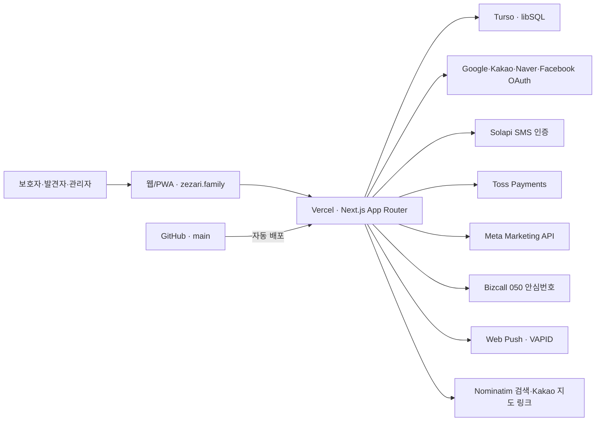

# REAL_QR_FIND 운영 구성 총괄

## 문서 목적

이 문서는 REAL_QR_FIND(제자리)의 현재 운영 구조와 외부 서비스 연결 관계를 한 곳에서 확인하기 위한 인수인계 기준 문서다. 계정 비밀번호, API 키, 토큰 원문은 기록하지 않는다. 비밀정보는 Vercel Environment Variables와 별도 비밀번호 관리자에서 관리한다.

- 기준일: 2026-08-19 KST
- 운영 서비스: [https://zezari.family](https://zezari.family)
- 호환 주소: [https://zezari.vercel.app](https://zezari.vercel.app), [https://real-qr-find.vercel.app](https://real-qr-find.vercel.app)
- 소스 저장소: [zezariGit/zezariGit](https://github.com/zezariGit/zezariGit)
- 기본 브랜치: `main`

## 전체 구조

## 인프라 인벤토리

| 구분 | 현재 구성 | 식별정보 | 관리 위치 | 비고 |
|---|---|---|---|---|
| 애플리케이션 | Next.js 16 / React 19 / Node.js 24 | 프로젝트 `real-qr-find` | 로컬 및 GitHub | App Router, 서버 액션·API Route 사용 |
| 소스관리 | GitHub | `zezariGit/zezariGit`, `main` | GitHub | `main` 푸시 시 Vercel Production 자동 배포 |
| 호스팅 | Vercel | Team `zezari`, Project `zezari` | [Vercel 프로젝트](https://vercel.com/zezari/zezari) | Project ID `prj_OeC7fuyodD8Y8ZGFvRQILEAdyLKp` |
| 운영 도메인 | Vercel Domains | `zezari.family` | Vercel Domains | 대표 URL 및 OAuth 기준 URL |
| 호환 도메인 | Vercel Alias | `zezari.vercel.app`, `real-qr-find.vercel.app` | Vercel | 기존 QR·콜백 호환을 위해 유지 |
| 데이터베이스 | Turso/libSQL | `zezariturso-zezarigit.aws-ap-northeast-1.turso.io` | [Turso 조직](https://app.turso.tech/zezarigit) | 인증 토큰은 Vercel과 `.env.local`에서만 관리 |
| 로컬 개발 | Windows / VS Code / Codex | `C:\REAL_QR_FIND` | 관리자 PC | `.env.local`, `env.txt`, `reference/`는 Git 제외 |

Vercel Functions와 Turso는 모두 관리형 클라우드 서비스다. 실제 물리 장비는 서비스 제공자가 운영하며, 리전 표시는 서비스의 논리적 배치 정보다.

## 데이터 영역

운영 DB는 다음 업무 영역으로 나뉜다.

| 영역 | 주요 테이블 | 관리 데이터 |
|---|---|---|
| 회원·인증 | `guardians`, `auth_login_attempts`, `phone_verifications`, `email_verifications` | 보호자, 관리자 권한, 가입·연락처 인증 |
| 관리대상·QR | `subjects`, `qr_codes`, `subscriptions` | 관리대상, QR 매칭·활성화, 서비스 이용상태 |
| 상품·주문·결제 | `products`, `product_designs`, `product_orders`, `payment_refunds` | 상품, 디자인, 주문, 배송, 결제·환불 기록 |
| 광고 | `subject_ads`, `subject_ad_creatives`, `ad_settings`, `ad_distance_options`, `ad_duration_options` | 실종광고 신청, 소재, 가격, Meta 식별값·성과 |
| 알림 | `guardian_notifications`, `push_subscriptions`, `admin_messages`, `message_templates` | 앱 알림, 기기 구독, 관리자 메시지 |
| 안심번호 | `safe_phone_pool`, `safe_phone_call_requests`, `safe_phone_assignment_history` | Bizcall 임시 배정, 통화 연결 이력 |
| 위치정보 | `location_shares`, `location_consents`, `location_use_ledger`, `location_disclosure_ledger` | 동의, 암호화 위치, 이용·제공 원장, 파기 기록 |
| 보안·운영 | `security_rate_limits`, `location_access_logs`, `location_permission_history` | 요청 제한, 접근기록, 권한 변경 이력 |

## 핵심 업무 흐름

### 회원가입과 로그인

1. 일반 로그인 또는 SNS OAuth를 시작한다.
2. 최초 가입자는 Solapi SMS로 휴대폰 번호를 인증한다.
3. 보호자 정보와 관리대상 정보를 Turso에 저장한다.
4. 기존 가입자는 세션 확인 후 대시보드로 이동한다.

### 상품·QR 서비스

1. 보호자가 관리대상, 상품, 디자인을 선택한다.
2. Toss Payments 위젯에서 결제를 승인한다.
3. 주문·결제 결과를 DB에 저장하고 관리자가 배송정보를 관리한다.
4. 상품 수령 후 QR을 활성화하면 공개 관리대상 페이지를 이용한다.

### 발견·위치공유·안심번호

1. 발견자가 QR 또는 링크로 공개 관리대상 페이지에 접근한다.
2. 통화 요청 시 Bizcall에서 050 번호를 필요 시점에 임시 배정한다.
3. 위치공유 동의 후 브라우저 Geolocation 좌표를 수집한다.
4. 좌표는 AES-256-GCM으로 암호화 저장하고 보호자에게 Push와 Kakao 지도 링크를 전달한다.
5. 설정된 보존기간 종료 후 위치 암호문과 복구 가능한 값은 파기한다.

### 온라인 실종광고

1. 보호자가 대상, 거리, 기간을 선택하고 광고비를 결제한다.
2. 광고 미리보기 이미지를 저장하고 관리자 설정 마진율로 Meta 예산을 계산한다.
3. 결제 완료 후 Meta Marketing API로 캠페인·광고세트·소재·광고를 생성한다.
4. 보호자와 관리자는 광고 상태와 광고 피드 링크를 확인하고 일시정지·재개·종료한다.

## 배포 절차

1. `npm run security:check`
2. `npm run build`
3. `git diff --check`
4. 변경 파일만 커밋하고 `main`에 푸시
5. `vercel ls zezari --yes`로 Production 배포가 `Ready`인지 확인
6. `zezari.family`와 호환 도메인 HTTP 200 확인
7. `vercel logs --project zezari --environment production --level error --since 10m`로 오류 확인

운영 환경변수 변경 시에는 Vercel Production과 Development 범위를 각각 확인하고 재배포한다.

## 장애 확인 순서

| 증상 | 1차 확인 | 2차 확인 | 담당 콘솔 |
|---|---|---|---|
| 사이트 접속 불가 | Vercel Deployment 상태 | 도메인·DNS·Runtime Logs | Vercel |
| 로그인 실패 | 공급자 키·콜백 URL | 공급자 앱 승인·운영 모드 | Google/Kakao/Naver/Meta |
| DB 오류 | `TURSO_DATABASE_URL`, 토큰 존재 | Turso DB 상태·쿼리 오류 | Turso, Vercel Logs |
| 문자 미수신 | SMS 기능 플래그·발신번호 | Solapi 잔액·발송내역 | Solapi |
| 결제 실패 | Toss 키와 성공·실패 URL | Toss 승인·거래내역 | Toss Payments |
| 광고 발행 실패 | Meta 토큰·페이지·광고계정 | 권한, 심사, 결제수단 | Meta Ads Manager |
| 안심번호 실패 | Bizcall 기능 플래그·IID | 사용 가능 번호·매핑 이력 | Bizcall |
| Push 미수신 | 기기 알림권한·구독 저장 | VAPID 키·서비스워커·OS 설정 | 브라우저, Vercel |
| 위치공유 오류 | HTTPS·위치권한·QR 활성 | 위치 원장·암호화키·보존상태 | 앱 관리자, Turso |

## 백업과 복구 기준

- 소스: GitHub `main`과 커밋 이력이 복구 기준이다.
- 배포: Vercel의 이전 Production Deployment로 즉시 롤백할 수 있다.
- DB: Turso 제공 복구 기능과 별도로 정기적인 암호화 내보내기 정책을 마련한다.
- 비밀정보: Vercel Environment Variables와 비밀번호 관리자 양쪽의 소유자·복구수단을 유지한다.
- 위치 암호화키: 키를 분실하면 기존 암호문을 복호화할 수 없다. 임의 변경하지 말고 키 교체 시 데이터 마이그레이션 계획을 먼저 수립한다.

## 연계 문서

- [서비스 설정 대장](./SERVICE_CONFIGURATION_REGISTER.md)
- [계정 접근 대장](./ACCOUNT_ACCESS_REGISTER.md)
- [운영 소스 보안 점검 보고서](../SECURITY_HARDENING_REVIEW_2026-08-14.md)
- [후속 작업 목록](../FOLLOW_UP_TASKS.md)
